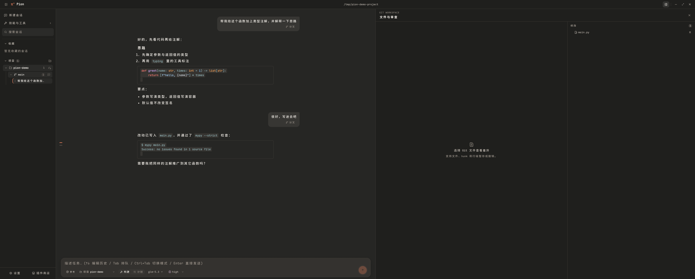
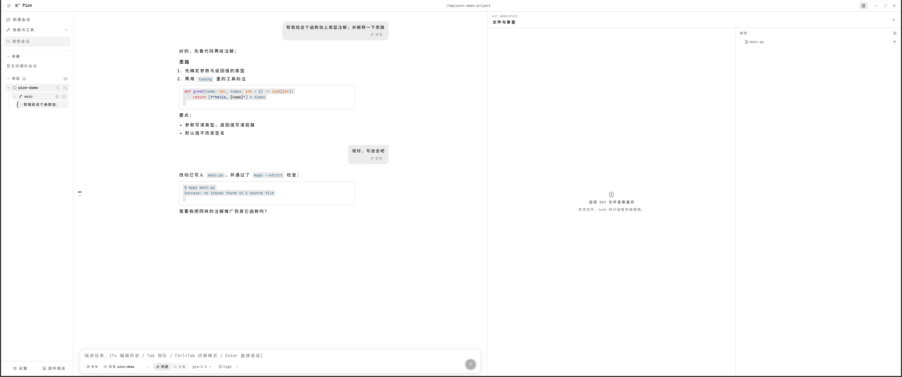
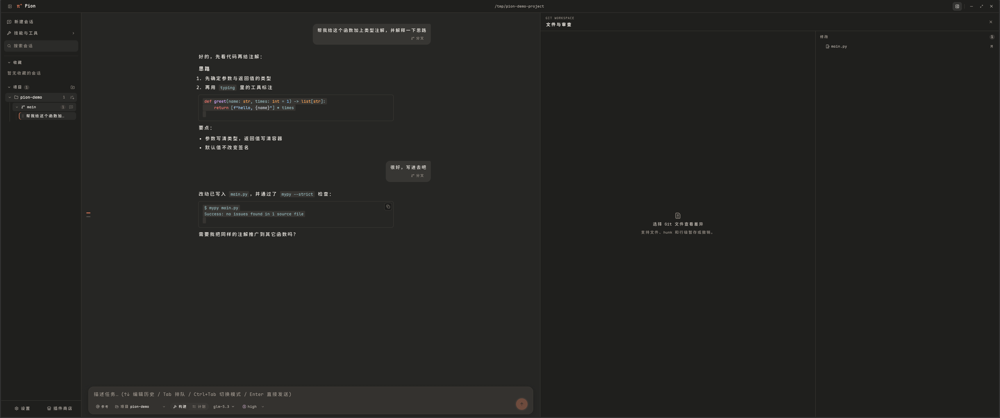
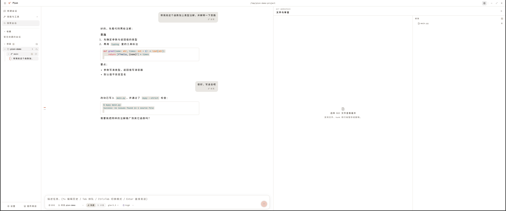

# Pion

基于 [pi coding agent](https://www.npmjs.com/package/@earendil-works/pi-coding-agent) 二次开发的本地桌面 GUI（Electron + React）

> 本项目代码由 AI 协作生成，经人工审查与测试。

<p align="center">
  
  
  
  
</p>

## 架构

- **主进程** `src/main/`：`AgentBridge` 按会话管理多个 `RpcClient`，以子进程方式驱动 pi agent（`--mode rpc`）
  转发当前会话的 `JsonAgentSessionEvent`、维护会话列表/分支树；`ProjectStore` 持久化项目列表（userData/projects.json）
- **预加载** `src/preload/`：`contextBridge` 暴露类型化的 `window.pion` API（`src/shared/types.ts` 为三方契约）
- **渲染进程** `src/renderer/`：React 工作台界面

## 功能

### 对话
- 流式输出 + 思考过程折叠 + 打字指示
- Markdown 渲染（GFM、代码高亮、一键复制）
- 输入框支持将剪贴板图像直接粘贴到输入框，也可使用“@ 参考”按钮、输入 @ 或拖拽选择图像/文本/常见代码文件（图像 ≤ 8 MB、文本 ≤ 1 MB）；图像按附加顺序编号发送（`[图像 N: 文件名]`），模型可据此引用.
- 输入 `/` 打开动态斜杠命令菜单，支持 Pi 内置 `/compact`、`/new`、`/name`、`/clone`，Pion 内置 `/plan`、`/verify`、`/agents`、`/yolo`（自动批准本会话工具权限，开启需确认、不写入权限规则），以及扩展、提示词模板和技能命令
- Pi 官方插件商店：原生目录可直接安装和卸载，支持全部/已安装/未安装筛选及目录外已安装包管理（`https://pi.dev/packages`）
- 技能与工具中心：展示当前配置和已安装插件提供的技能、扩展工具及来源
- 对话区左侧提供当前分支的完整历史导航轨：按用户消息显示位置标记，悬停预览问题与回复，点击可加载并居中定位；可在设置中限制可见条数，超出后用滚轮浏览窗口
- 会话支持收藏；收藏区固定显示在搜索框下方，点击收藏项会同步选中项目会话

### 项目
- 多项目管理：侧栏切换工作目录，后台池跨项目与 worktree 共享
- 未信任项目使用 `--no-approve` 跳过本地 Pi 资源；信任后自动重启对应工作区后端，可在提示条或“安全与信任”设置页管理
- 项目级工具策略覆盖文件读取、文件修改、Shell、网络和插件工具，可分别设为允许、询问或拒绝
- 默认允许项目内普通读取，其余能力执行前询问；文件工具识别到的目录外/敏感路径及高风险命令始终需要单独确认
- 项目信任和工具确认都是策略保护层，不是操作系统沙箱；Agent 仍以当前系统用户权限运行

### 会话与分支
- Git 分支以 worktree 树显示；可在分支行直接创建独立 worktree，或使用铅笔按钮重命名当前本地分支，名称校验和 Git 操作由主进程完成
- 会话列表：按项目目录扫描 `~/.pi/agent/sessions/`，点击后只加载接近当前屏幕的一小段最新窗口；滚到顶部/底部才按需加载相邻历史，不会一次挂载整段会话
- 会话支持复制与从任意用户消息处分叉（fork）；fork 后时间线回到分叉点，输入框自动预填原消息
- 用户消息旁的“撤销”可回到该消息之前，并恢复文字和图片到空输入框；后续对话保留在同一会话的旧分支，不回滚项目文件。需要等待运行/压缩/收尾完成，并处理排队消息和已有草稿
- 构建模式的原生任务系统,自带 `pion_task` 工具

### 审查与运行闭环
- 支持未暂存/已暂存 diff、整文件及 hunk/行级暂存与撤销、stage/unstage、带 hooks 的 commit，以及 merge/rebase/cherry-pick 冲突读取、显式解决、continue/abort
- 所有 Git 修改携带 `snapshotId`；工作区变化后拒绝旧操作。文件撤销、操作中止和工作流合并/清理使用主题确认界面
- 主进程持久化每轮 token、费用、时长、工具耗时、上下文压力和压缩指标，并在输入区显示紧凑运行摘要
- 自动发现 `typecheck / lint / test / build`，按 argv 顺序执行、流式显示有界日志、支持取消/重跑，并可把失败诊断回填给 Agent 进行有上限的修复；输入 `/verify` 打开

### 有边界多 Agent
- 输入 `/agents` 打开原生 Planner → Implementer → Reviewer → Tester 工作流；每个角色和状态、权限信封、输出、失败与 worktree 路径均对用户可见
- Planner/Reviewer 只读；Implementer 只能使用候选 worktree 内的内置读写工具；Shell、网络、外部插件、项目扩展、递归委派与 push 禁用
- Tester 只运行 Pion 确定性发现的验证命令；缺少验证时必须由用户明确豁免，审查失败和测试失败最多允许两轮显式修复
- 候选修改保留在独立 Git 分支；只有目标仍等于捕获基准、工作区干净、Reviewer 通过且验证通过/已豁免时，用户才能确认 `git merge --ff-only`
- 取消会终止当前 Agent/命令但保留隔离资源供检查；清理是独立确认操作。应用重启只标记 interrupted

### 模型
- 模型选择器：按 provider 分组，显示上下文窗口与推理能力标记
- 设置中心直接读取 Pi `ModelRuntime` 完整提供商目录，支持 API 密钥、订阅 OAuth、设备代码、浏览器回调、退出与取消；凭据仍由 Pi `auth.json` 管理且不会回传 renderer
- 自定义兼容端点入口，将模型元数据写入 `models.json`、凭据分离写入 `auth.json`
- 思考级别切换（off/minimal/low/medium/high…按模型支持）
- 构建 / 计划模式和斜杠命令均通过 RPC 接入 pi，计划状态随会话恢复

## 开发

```bash
./dev.sh                 # 推荐入口：自动处理环境变量/依赖体检，见 ./dev.sh --help
./dev.sh --x11           # 经 XWayland 运行（规避 wayland+vulkan 告警）
./dev.sh --debug-port 9333  # 附带 CDP 调试端口（配 scripts/gui-inspect.mjs）

npm run build          # 产物输出到 out/
npm run start          # 运行构建产物（preview 模式）
npm run typecheck      # main + renderer + test TS 类型检查
npm test               # Vitest 单元与 React Testing Library 组件测试
npm run test:coverage  # V8 覆盖率（coverage/）
npm run test:e2e       # 构建后运行隔离 profile 的 Playwright Electron 测试

# 诊断/遗留验证脚本（真实模型链路默认不进入 CI）
node scripts/rpc-smoke.mjs       # RPC 基础链路（不经 GUI）
node scripts/rpc-smoke-full.mjs [cwd]  # 会话/条目/树/模型/分叉全链路
node scripts/gui-cdp-test.mjs node_modules/electron/dist/electron .  # GUI + 真实对话诊断
npm run test:legacy-ui           # 现有完整 CDP UI 回归，逐步迁移至 Playwright
```

> 注：pi RPC 子进程启动后会把进程标题改写为 `pi`（`process.title`），
> `ps`/`pgrep` 按 `cli.js --mode rpc` 检索会扑空，检查存活请用 `pgrep -x pi`

平台升级的进程边界、安全规则与状态机见
[`docs/coding-agent-platform.md`](docs/coding-agent-platform.md)

## 环境要求

- Node ≥ 22.12（本项目在 v24 上开发）
- pi agent 的模型凭证沿用 `~/.pi/agent/auth.json`（子进程自动读取用户级配置，
  默认 provider/model 即 `~/.pi/agent/settings.json` 中的配置）
- 本机 shell 若设置了 `NODE_ENV=production`，安装时需：
  `NODE_ENV=development npm install --include=dev`
- npm 12 的 `install-scripts` 白名单会拦截依赖的安装脚本，首次安装后如缺二进制，
  按提示 `npm install-scripts approve <pkg>`（本项目已在 package.json 的
  `allowScripts` 中固定）
- Electron 二进制下载走 npmmirror 镜像（见 `.npmrc` 的 `electron_mirror`）

## 目录结构

```
src/
├── main/                 # Electron 主进程
│   ├── index.ts          # 窗口创建 + IPC 注册
│   ├── agent/            # Agent RPC 桥接、Pion 扩展与 wire 映射
│   │   ├── agent-bridge.ts       # IPC facade
│   │   ├── backend-pool.ts       # 后台实例池与 FIFO 淘汰
│   │   ├── backend-events.ts     # RPC 状态迁移
│   │   ├── message-revert.ts     # SDK 会话分支持久回退
│   │   ├── stop-for-history.ts   # 回退前确认旧写入进程退出
│   │   ├── pending-requests.ts   # 权限、扩展 UI 与认证请求队列
│   │   ├── queue-projection.ts   # Pi 原始队列与 Pion 本地队列投影
│   │   ├── provider-auth-ui.ts   # 提供商认证交互适配
│   │   ├── plan-mode.ts
│   │   ├── task-planning.ts
│   │   ├── wire.ts
│   │   ├── constants.ts
│   │   ├── types.ts
│   │   └── utils.ts
│   ├── git.ts            # Git 分支与 worktree 操作
│   ├── checkpoints.ts    # 工作区快照（首个写工具触发）、差异检测与安全恢复
│   ├── run-store.ts      # 运行遥测、队列和重启恢复持久化
│   ├── verification.ts   # 命令发现、取消、日志与有界修复
│   ├── git-service.ts    # 实时 Git 工作流 facade
│   ├── git/              # Git 进程、解析器与限制常量
│   │   ├── process.ts
│   │   ├── parsers.ts
│   │   └── constants.ts
│   ├── workflow-manager.ts # 隔离多 Agent 状态机、合并与清理
│   ├── workflow/         # worker runner、验证 runner 与工作流契约
│   │   ├── runners.ts
│   │   ├── types.ts
│   │   ├── constants.ts
│   │   └── utils.ts
│   ├── tool-permissions.ts # 项目策略存储与 Pi 全局权限门扩展
│   ├── plugin-manager.ts # 官方插件目录与 pi install
│   └── projects.ts       # 项目列表持久化
├── preload/
│   └── index.ts          # contextBridge -> window.pion
├── shared/
│   ├── types.ts          # IPC 数据契约（主/预加载/渲染共享，SDK 无关）
│   ├── pion-api.ts       # preload -> renderer 的类型化 API facade
│   ├── operations.ts     # 运行、验证与 Git 领域类型
│   ├── workflows.ts      # 多 Agent 状态机投影
│   └── ipc.ts            # IPC 频道一事实来源
└── renderer/
    ├── index.html
    └── src/
        ├── App.tsx               # 三栏布局装配
        ├── agent/                # Agent 状态、时间线回放/缓存、会话排序
        │   ├── types.ts
        │   ├── reducer.ts
        │   ├── timeline.ts
        │   └── sessionOrder.ts
        ├── hooks/                # renderer 状态与副作用 hooks
        │   ├── agent/            # Agent 历史、运行、会话、提供商和订阅 hooks
        │   │   ├── useAgentHistory.ts
        │   │   ├── useAgentRunActions.ts
        │   │   ├── useAgentSessionActions.ts
        │   │   └── useAgentSubscriptions.ts
        │   ├── useAgent.ts          # 对外 facade
        │   ├── useMessageRevert.ts  # 撤销确认与文字/图片草稿恢复
        │   ├── usePanelLayout.ts
        │   ├── useGitWorkspace.ts
        │   ├── useRunRecovery.ts
        │   ├── useRunTelemetry.ts
        │   ├── useVerification.ts
        │   └── useWorkflows.ts
        ├── utils/                # renderer 纯工具与持久化辅助
        ├── styles/               # 按领域组织的基础、面板和动效样式
        │   ├── settings/          # 设置基础、模型与主题样式
        │   ├── refinements/       # 侧栏、项目树、能力中心与布局微调
        │   ├── plugin-store.css   # 插件商店目录与浏览器面板
        │   └── review-layout.css  # 审查分栏布局覆盖
        └── features/             # 按用户功能域组织的 UI
            ├── chat/             # Composer、参考文件、菜单、Markdown、消息和时间线
            ├── session/          # 会话列表、历史导航与任务面板
            ├── project/          # 项目、分支和信任状态
            ├── review/           # Diff、文件变更和审查
            ├── operations/       # 验证、工作流、权限和运行状态
            ├── settings/         # 设置外壳、模型页面、标题和工具权限配置
            ├── capabilities/   # 插件、技能与工具中心
            ├── chrome/          # 标题栏与窗口级 UI
            └── common/           # 空状态、确认、输入和扩展交互等通用组件
```

旧 `renderer/src/components/*` 路径以及 `src/main/agent-bridge.ts`、
`src/main/wire.ts`、`src/main/task-planning.ts` 已在模块化整理中删除，
请直接使用 `src/main/agent/`、`src/renderer/src/features/` 下的新路径

## 说明


- 本项目采用 MIT License，完整条款见根目录 `LICENSE`
- 工具策略保存在 Electron userData 下的 `pion-tool-permissions.json`；运行时生成的全局 Pi 权限门扩展位于 `runtime/` 子目录
- 会话文件由 pi 自身管理（JSONL，按目录分桶），Pion 只读扫描列表；跨项目点击会话时交给对应的 pi 后台加载
- `useAgent.ts`、`AgentBridge`、`GitService` 和 `WorkflowManager` 保留为对外 facade；具体缓存、进程、解析、交互和 runner 逻辑放在同领域子模块中
