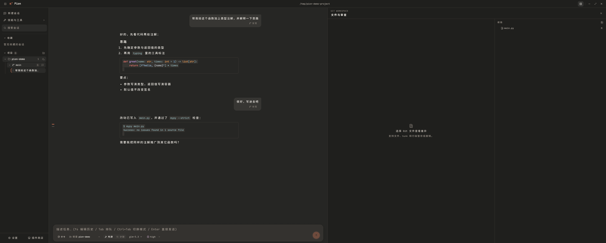
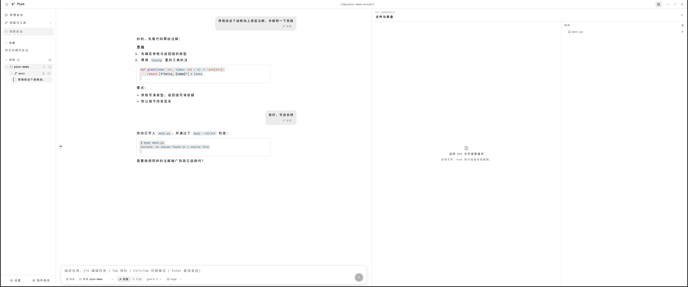

# Pion

给 [pi coding agent](https://www.npmjs.com/package/@earendil-works/pi-coding-agent) 做的桌面客户端，把对话、项目会话、Git diff 和终端放在一个窗口里。

<p align="center">
  
  
</p>

## 主要功能

- 流式回复、思考折叠、Markdown 和代码高亮。可以贴图片、拖文件，或用 `@` 添加参考。
- 管理多个项目和 Git worktree。会话支持后台运行、收藏、复制、分叉和历史跳转。
- 查看 Git diff，按文件或行暂存，提交修改、处理冲突。
- 任务计划、并行子代理，以及在独立 worktree 中运行的多 Agent 工作流。
- 切换模型和思考级别，安装插件与技能；也接入了 MCP、codemode 和 tool search。
- Codex 生图和参考图编辑，目前是实验功能。
- 内置终端、可调整的分栏布局，以及深浅色和“信号橙”等主题。

## 使用

Windows 和 Linux 安装包在 [Releases](https://github.com/NiST0001/Pion/releases)。运行需要 Node ≥ 22.19，推荐 Node 24。

打开后，先在设置里配置模型，再选择项目。已有的 pi 用户配置可以继续使用。

- **Enter**：发送消息，运行中追加引导。
- **Tab**：排队发送。
- **Shift+Enter**：换行。
- 输入 `/` 查看命令；`/plan` 切换计划模式，`/verify` 打开验证，`/agents` 打开多 Agent 工作流。

生图可以直接说：`画一艘红色小船，保存到 images/boat.png`。编辑图片时，告诉它参考哪张图、保存到哪里就行。

生图需要 Codex 登录和图片额度，参考图会连同元数据上传。codemode 可能调用付费模型；请求失败或取消，仍可能收费或消耗额度。参数、账号要求和 MCP 配置见[开发文档](docs/development.md)。

对话里的撤销不会回滚项目文件。工具权限确认不是系统沙箱，内置终端也不受 Agent 的工具确认限制。

## 从源码运行

项目使用 Electron、React、TypeScript 和 Vite。

```bash
npm install
./dev.sh
```

构建用 `npm run build`。类型检查、测试、本机安装和打包方法都在[开发文档](docs/development.md)里。

## 相关文档

- [源码与测试索引](map.md)
- [开发约定](AGENTS.md)
- [平台设计参考](docs/coding-agent-platform.md)

[MIT License](LICENSE)
